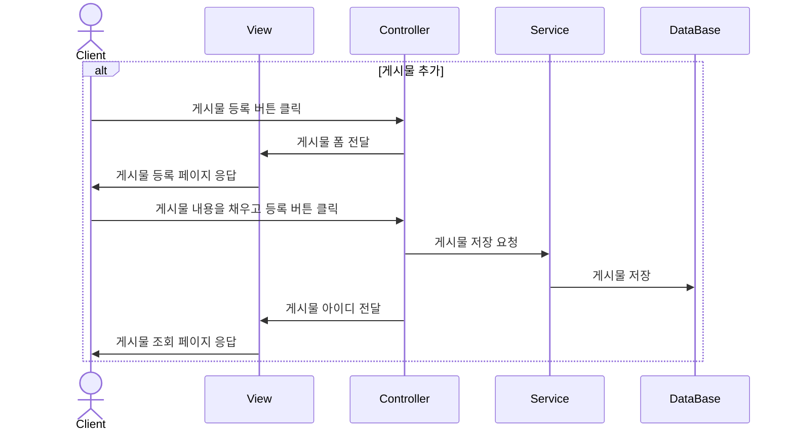
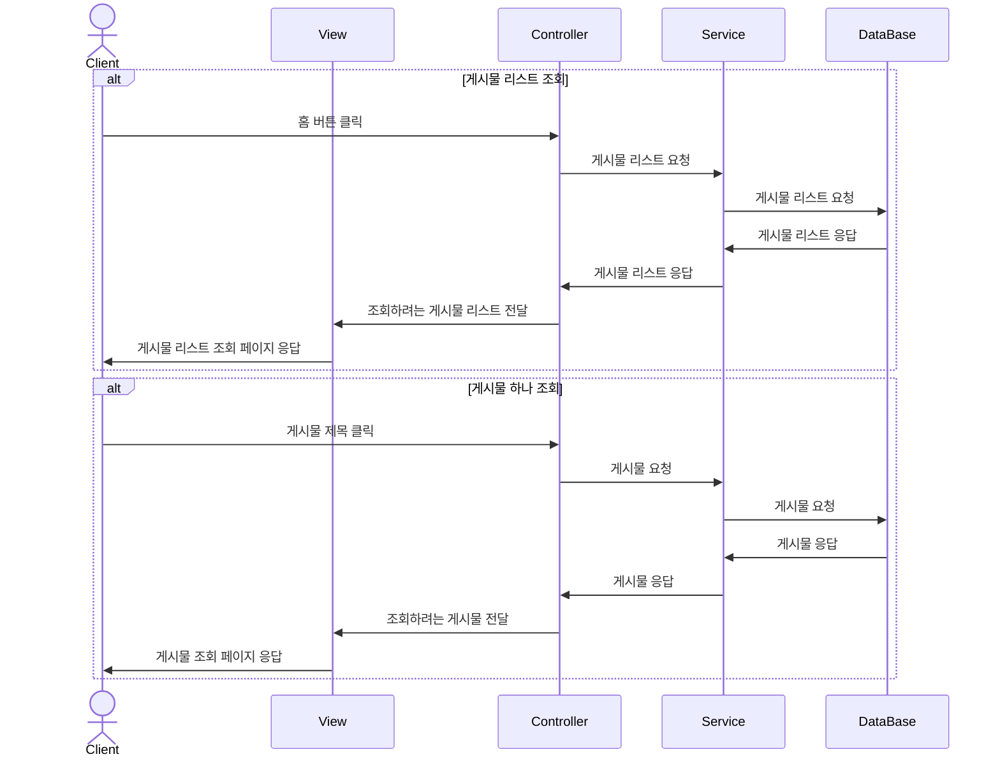
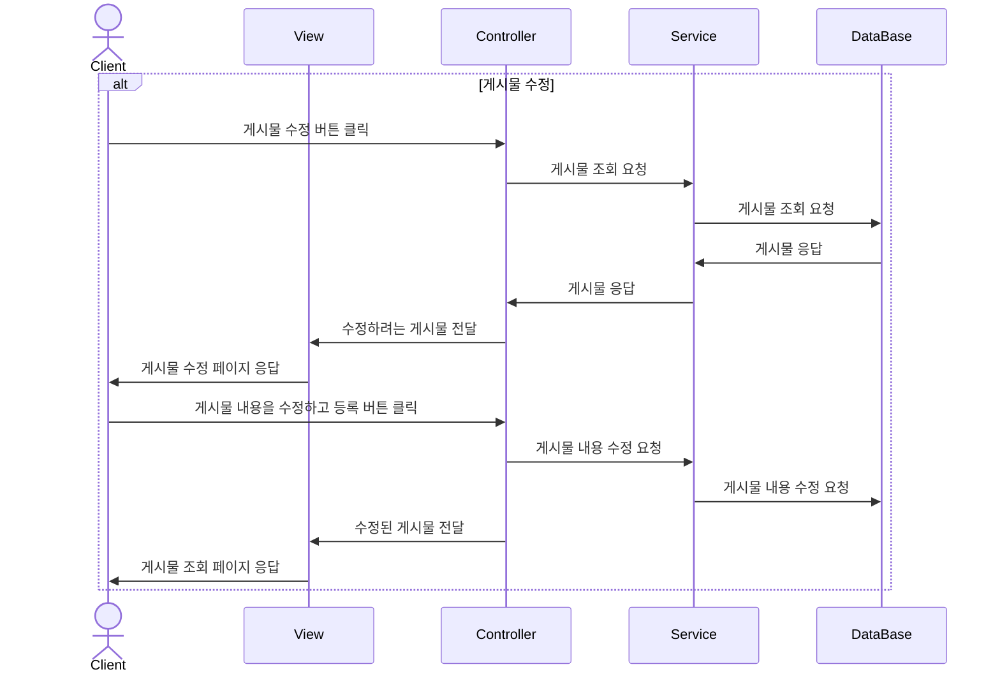
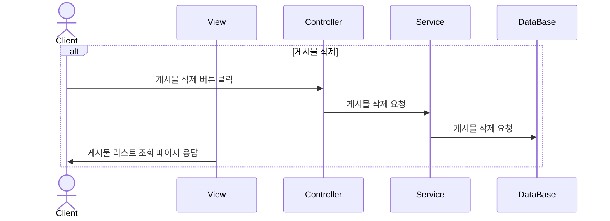

```mermaid
sequenceDiagram

    actor A as Client
    participant V as View
    participant C as Controller
    participant S as Service
    participant DB as DataBase

    alt 게시물 추가
    A->>C:게시물 등록 버튼 클릭
    C->>V:게시물 폼 전달
    V->>A:게시물 등록 페이지 응답
    A->>C:게시물 내용을 채우고 등록 버튼 클릭
    C->>S:게시물 저장 요청
    S->>DB:게시물 저장
    C->>V:게시물 아이디 전달
    V->>A:게시물 조회 페이지 응답
    end
```

```mermaid
sequenceDiagram

    actor A as Client
    participant V as View
    participant C as Controller
    participant S as Service
    participant DB as DataBase

    alt 게시물 리스트 조회
    A->>C:홈 버튼 클릭
    C->>S:게시물 리스트 요청
    S->>DB:게시물 리스트 요청
    DB->>S:게시물 리스트 응답
    S->>C:게시물 리스트 응답
    C->>V:조회하려는 게시물 리스트 전달
    V->>A:게시물 리스트 조회 페이지 응답
    end

    alt 게시물 하나 조회
    A->>C:게시물 제목 클릭
    C->>S:게시물 요청
    S->>DB:게시물 요청
    DB->>S:게시물 응답
    S->>C:게시물 응답
    C->>V:조회하려는 게시물 전달
    V->>A:게시물 조회 페이지 응답
    end
```

```mermaid
sequenceDiagram

    actor A as Client
    participant V as View
    participant C as Controller
    participant S as Service
    participant DB as DataBase

    alt 게시물 수정
    A->>C:게시물 수정 버튼 클릭
    C->>S:게시물 조회 요청
    S->>DB:게시물 조회 요청
    DB->>S:게시물 응답
    S->>C:게시물 응답
    C->>V:수정하려는 게시물 전달
    V->>A:게시물 수정 페이지 응답
    A->>C:게시물 내용을 수정하고 등록 버튼 클릭
    C->>S:게시물 내용 수정 요청
    S->>DB:게시물 내용 수정 요청
    C->>V:수정된 게시물 전달
    V->>A:게시물 조회 페이지 응답
    end
```

```mermaid
sequenceDiagram

    actor A as Client
    participant V as View
    participant C as Controller
    participant S as Service
    participant DB as DataBase

    alt 게시물 삭제
    A->>C:게시물 삭제 버튼 클릭
    C->>S:게시물 삭제 요청
    S->>DB:게시물 삭제 요청
    V->>A:게시물 리스트 조회 페이지 응답
    end
```